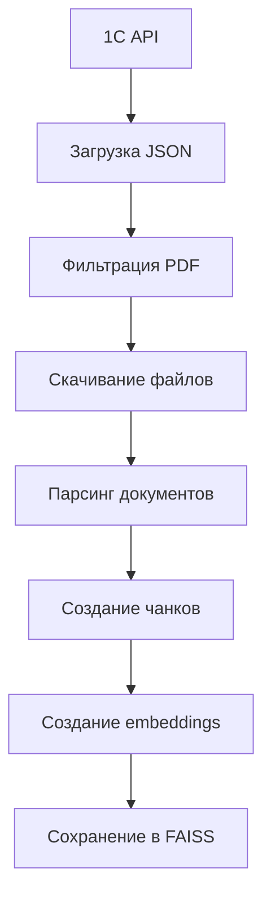
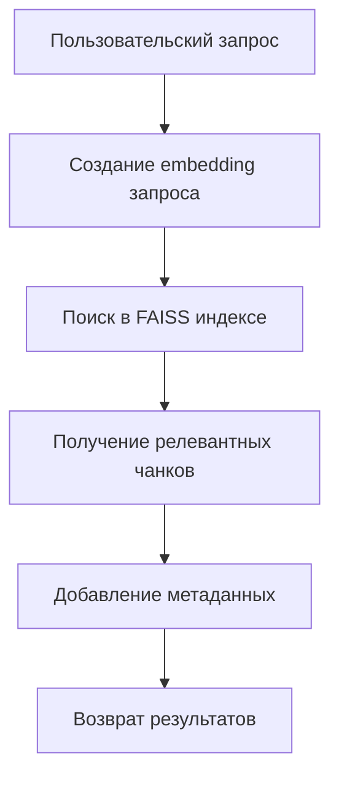

# Документация проекта "Нейроассистент для личного кабинета"

## 📋 Описание проекта

**Нейроассистент для личного кабинета** — это интеллектуальная система, которая помогает пользователям находить информацию в их документах через семантический поиск. Система построена на основе технологии RAG (Retrieval-Augmented Generation) с использованием векторной базы данных FAISS.

### Основные возможности:
- 📄 Загрузка и обработка документов различных форматов (PDF, DOCX, TXT, изображения)
- 🔍 Семантический поиск по содержимому документов
- 🎯 Мультиклиентская архитектура (каждый клиент имеет свой индекс)
- 🌐 REST API для интеграции с веб-приложениями
- 📊 Веб-интерфейс для просмотра данных и статистики

## 🏗️ Архитектура проекта

```
├── faiss_vs/                     # Основной модуль RAG системы
│   ├── src/                      # Исходный код
│   │   ├── data/                 # Обработка данных
│   │   │   ├── loaders.py        # Загрузка документов
│   │   │   ├── chunkers.py       # Разбивка на фрагменты
│   │   │   └── image_processor.py # Обработка изображений
│   │   ├── vectorstore/          # Векторная база данных
│   │   │   └── faiss_manager.py  # Управление FAISS индексом
│   │   ├── document_processor.py # Главный процессор документов
│   │   └── config.py             # Конфигурация системы
│   ├── routes.py                 # API маршруты
│   ├── faiss_loader.py           # Загрузчик из 1С API
│   └── webViewer.py              # Веб-интерфейс для просмотра
├── lk_assistant/                 # Модуль ассистента
│   ├── main.py                   # Логика ассистента
│   └── routes.py                 # API маршруты ассистента
└── main.py                       # Главный файл приложения
```

## 🔧 Установка и настройка

### 1. Установка зависимостей

```bash
pip install -r requirements.txt
```

### 2. Структура данных

Система автоматически создает следующие папки:
```
faiss_vs/data/
├── documents/           # Скачанные документы (по client_id)
├── processed/           # Обработанные данные
└── faiss_index/         # FAISS индексы
    └── clients/         # Папки для каждого клиента
        └── {client_id}/ # Данные конкретного клиента
            ├── index.faiss      # FAISS индекс
            ├── metadata.pkl     # Метаданные чанков
            ├── mappings.json    # Маппинги ID
            ├── config.json      # Конфигурация
            └── data.json        # Исходные данные
```

### 3. Запуск системы

```bash
# Запуск основного API
python main.py

# Запуск веб-интерфейса для просмотра данных
python faiss_vs/webViewer.py
```

## 📚 Основные компоненты

### 1. DocumentProcessor - Главный процессор документов

**Файл:** `faiss_vs/src/document_processor.py`

Это центральный класс, который управляет всем процессом обработки документов.

```python
# Создание процессора для конкретного клиента
processor = DocumentProcessor(client_id="your_client_id")

# Обработка документов из JSON файла
stats = processor.process_documents_from_json("documents.json")

# Поиск по документам
results = processor.search_documents("ваш запрос", k=5)
```

**Основные методы:**
- `process_documents_from_json()` - обрабатывает документы из JSON
- `search_documents()` - выполняет поиск по индексу
- `get_index_statistics()` - возвращает статистику индекса
- `remove_document()` - удаляет документ из индекса

### 2. FAISSManager - Управление векторной базой

**Файл:** `faiss_vs/src/vectorstore/faiss_manager.py`

Управляет FAISS индексом и векторными операциями.

```python
# Создание менеджера
faiss_manager = FAISSManager(client_id="your_client_id")

# Добавление чанков в индекс
faiss_manager.add_chunks(chunks)

# Поиск похожих документов
results = faiss_manager.search("запрос", k=5)

# Сохранение индекса
faiss_manager.save_index()
```

### 3. DocumentLoader - Загрузка документов

**Файл:** `faiss_vs/src/data/loaders.py`

Скачивает и парсит документы различных форматов.

**Поддерживаемые форматы:**
- PDF (PyPDF2)
- DOCX (python-docx) 
- TXT, MD (текстовые файлы)
- HTML (BeautifulSoup)
- PPTX (python-pptx)
- Изображения с OCR (опционально)

### 4. DocumentChunker - Разбивка на фрагменты

**Файл:** `faiss_vs/src/data/chunkers.py`

Разбивает большие документы на управляемые фрагменты (чанки).

**Настройки по умолчанию:**
- Размер чанка: 1000 символов
- Перекрытие: 200 символов
- Интеллектуальная разбивка по предложениям

## 🌐 API Endpoints

### FAISS API (`/faiss/`)

#### 1. Создание индекса
```http
POST /faiss/create_index
Content-Type: application/json

{
    "client_id": "your_client_id"
}
```

**Что происходит:**
1. Система загружает данные из 1С API
2. Скачивает PDF документы
3. Парсит их и создает чанки
4. Создает векторные представления
5. Сохраняет в FAISS индекс

#### 2. Поиск по документам
```http
POST /faiss/search
Content-Type: application/json

{
    "client_id": "your_client_id",
    "query": "текст для поиска",
    "k": 5
}
```

#### 3. Получение информации об индексе
```http
GET /faiss/get_index
Content-Type: application/json

{
    "client_id": "your_client_id"
}
```

### Assistant API (`/assistant/`)

#### Запрос к ассистенту
```http
POST /assistant/ask
Content-Type: application/json

{
    "message": "ваш вопрос",
    "client_id": "your_client_id"
}
```

## 🔧 Утилиты и инструменты

### 1. Веб-интерфейс для просмотра данных

```bash
python faiss_vs/webViewer.py
```

Откройте http://localhost:8000 для доступа к:
- Просмотру всех чанков клиента
- Статистике индекса
- Поиску по документам
- Фильтрации по файлам

### 2. Очистка данных клиента

```bash
python faiss_vs/quick_cleanup.py your_client_id
```

Удаляет все данные конкретного клиента (документы, индекс, метаданные).

### 3. Проверка метаданных

```bash
python faiss_vs/check_metadata.py your_client_id
```

Анализирует метаданные в индексе клиента.

### 4. Просмотр содержимого индекса

```bash
python faiss_vs/simple_viewer.py
```

Показывает что сохранено в индексе.

## ⚙️ Конфигурация

**Файл:** `faiss_vs/src/config.py`

Основные настройки системы:

```python
class Settings:
    # Пути
    PROJECT_ROOT: Path = Path(__file__).parent.parent
    DATA_DIR: Path = PROJECT_ROOT / "data"
    DOCUMENTS_DIR: Path = DATA_DIR / "documents"
    FAISS_INDEX_DIR: Path = DATA_DIR / "faiss_index"
    
    # Embeddings
    EMBEDDING_MODEL: str = "sentence-transformers/all-MiniLM-L6-v2"
    EMBEDDING_DIMENSION: int = 384
    
    # Чанкинг
    CHUNK_SIZE: int = 1000
    CHUNK_OVERLAP: int = 200
    
    # FAISS
    FAISS_INDEX_TYPE: str = "FlatIP"  # Inner Product для cosine similarity
    
    # Обработка файлов
    MAX_FILE_SIZE_MB: int = 50
    SUPPORTED_EXTENSIONS: list = [".pdf", ".docx", ".txt", ".md", ".html", ".jpg", ".jpeg", ".png"]
    
    # Сеть
    REQUEST_TIMEOUT: int = 30
    MAX_RETRIES: int = 3
```

## 🔄 Рабочий процесс (Workflow)

### 1. Загрузка документов клиента



### 2. Поиск по документам



## 📊 Метаданные документов

Каждый чанк содержит богатые метаданные:

```json
{
    "source_url": "https://...",
    "title": "Название документа",
    "description": "Описание",
    "date": "2024-01-15",
    "guid_doc": "uuid-документа",
    "parent": "Категория",
    "object_id": "ID объекта",
    "category": "tech",
    "file_type": ".pdf",
    "filename": "document.pdf",
    "file_size": 1048576,
    "processing_date": "2024-01-15T10:30:00",
    "client_id": "client_id",
    "chunk_size": 945,
    "chunk_index": 2,
    "chunk_id": "abc123...",
    "has_tables": false,
    "has_lists": true
}
```

## 🛠️ Примеры использования

### Базовый пример обработки документов

```python
from faiss_vs.src.document_processor import DocumentProcessor

# Создаем процессор для клиента
processor = DocumentProcessor(client_id="test_client")

# Пример JSON с документами
documents_json = {
    "result": [
        {
            "ID": "https://example.com/document.pdf",
            "Description": "Техническая документация",
            "Parent": "Техника",
            "Date": "2024-01-15",
            "GuidDoc": "uuid-123"
        }
    ]
}

# Сохраняем в файл
import json
with open('documents.json', 'w', encoding='utf-8') as f:
    json.dump(documents_json, f, ensure_ascii=False)

# Обрабатываем документы
stats = processor.process_documents_from_json('documents.json')
print(f"Обработано: {stats['indexed']} чанков")

# Поиск
results = processor.search_documents("техническая документация", k=3)
for result in results:
    print(f"Найдено: {result['source_file']} (score: {result['score']:.3f})")
```

### Работа с API

```python
import requests

# Создание индекса для клиента
response = requests.post('http://localhost:8000/faiss/create_index', json={
    'client_id': 'your_client_id'
})

if response.json()['status'] == 'ok':
    print(f"Обработано документов: {response.json()['processed_documents']}")

# Поиск
search_response = requests.post('http://localhost:8000/faiss/search', json={
    'client_id': 'your_client_id',
    'query': 'ваш поисковый запрос',
    'k': 5
})

results = search_response.json()
```

## 🐛 Отладка и мониторинг

### Логирование

Система использует стандартное логирование Python:

```python
import logging
logging.basicConfig(level=logging.INFO)
logger = logging.getLogger(__name__)
```

### Проверка состояния индекса

```python
# Получение статистики
stats = processor.get_index_statistics()
print(f"Статус: {stats['status']}")
print(f"Векторов: {stats['total_vectors']}")
print(f"Источников: {stats['sources_count']}")
```

### Типичные проблемы и решения

1. **Индекс не загружается**
   - Проверьте существование файлов в `faiss_index/clients/{client_id}/`
   - Убедитесь, что процесс имеет права на чтение/запись

2. **Плохое качество поиска**
   - Увеличьте размер чанков в конфигурации
   - Используйте более мощную модель embeddings
   - Улучшите предобработку текста

3. **Медленная обработка**
   - Уменьшите размер батчей для embeddings
   - Используйте GPU версию sentence-transformers
   - Оптимизируйте размер чанков

## 🚀 Развитие проекта

### Планируемые улучшения:

1. **Обработка изображений с OCR**
   - Установка: `pip install easyocr`
   - Активация в `image_processor.py`

2. **Поддержка больших файлов**
   - Потоковая обработка PDF
   - Разбивка по главам

3. **Улучшенный поиск**
   - Гибридный поиск (semantic + keyword)
   - Фильтрация по метаданным
   - Ранжирование результатов

4. **Интеграция с LLM**
   - Генерация ответов на основе найденных документов
   - Summarization найденной информации

## 📞 Поддержка

Для вопросов по разработке и использованию системы:

1. Изучите логи в консоли
2. Используйте веб-интерфейс для отладки
3. Проверьте конфигурацию в `config.py`
4. Убедитесь в корректности JSON данных

---

*Документация обновлена: 2024-01-15*